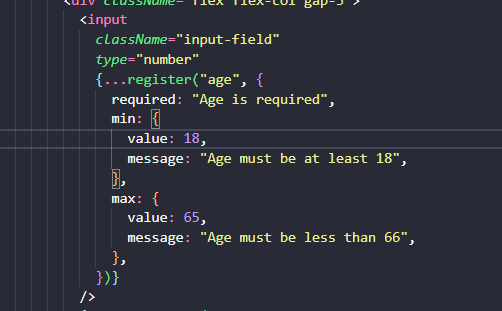
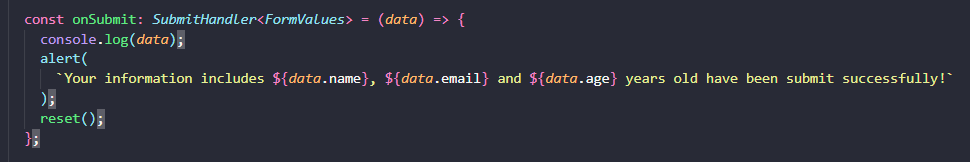

### 1. Explain the purpose of the register function in React Hook Form.

The `register` function in React Hook Form is used to connect your input elements to the form's validation and state management. By registering an input, you enable it to be tracked by React Hook Form, which handles its value, validation, and any errors associated with it. Essentially, `register` ensures that your form inputs are integrated into the form handling system provided by React Hook Form.

### 2. How can you set custom validation rules for a form field in React Hook Form? Provide an example.

You can set custom validation rules for a form field by passing validation rules as an object to the `register` function.
I am using required, min and max to validate this field. This field must not be empty, at least 18 and max 66 years.

### 3. Describe how you would handle form reset in React Hook Form.

To handle form reset in React Hook Form, you can use the `reset` function provided by the `useForm` hook. This function allows you to reset the form's values to their default state or to specific values you provide.

